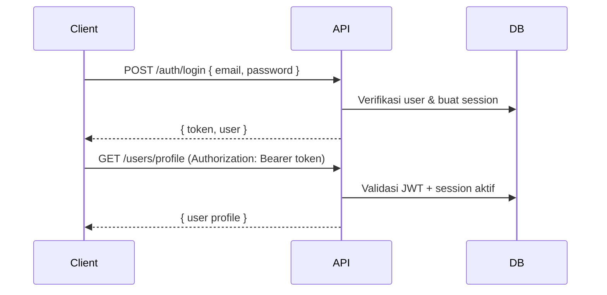

# Dokumentasi HONO-BACKEND

Panduan lengkap penggunaan, pengembangan, dan integrasi API.

## Daftar Isi

1. [Arsitektur](#1-arsitektur)
2. [Setup & Environment](#2-setup--environment)
3. [Menjalankan Aplikasi](#3-menjalankan-aplikasi)
4. [Konvensi API](#4-konvensi-api)
5. [Autentikasi & Authorization](#5-autentikasi--authorization)
6. [Endpoint Reference](#6-endpoint-reference)
7. [File Storage](#7-file-storage)
8. [Background Job & Cron](#8-background-job--cron)
9. [WebSocket Realtime](#9-websocket-realtime)
10. [Database & Migration](#10-database--migration)
11. [Membuat Modul CRUD Baru](#11-membuat-modul-crud-baru)
12. [Middleware & Error Handling](#12-middleware--error-handling)
13. [Docker Compose](#13-docker-compose)
14. [Troubleshooting](#14-troubleshooting)

---

## 1. Arsitektur

Proyek ini memisahkan tanggung jawab ke beberapa layer:

```text
Request
  → Middleware (context, logger, CORS, rate limit, auth)
  → Route (validasi Zod)
  → Service (business logic)
  → Repository (query database)
  → PostgreSQL / Redis / MinIO
```

**Dua proses utama:**

| Proses | File entry | Fungsi |
|---|---|---|
| HTTP Server | `src/server.ts` | Melayani REST API + WebSocket upgrade |
| Worker | `src/worker.ts` | Memproses queue BullMQ & cron job |

Keduanya berbagi codebase yang sama, tetapi dijalankan sebagai proses terpisah.

---

## 2. Setup & Environment

### Prasyarat

- Node.js >= 20
- PostgreSQL 16
- Redis 7
- MinIO (atau S3 compatible)

### Langkah awal

```bash
cp .env.example .env
npm install
npm run build
npm run db:migrate
npm run seed
```

### Variabel environment

| Variabel | Wajib | Default | Deskripsi |
|---|---|---|---|
| `NODE_ENV` | — | `development` | `development` / `test` / `production` |
| `APP_NAME` | — | `pltu-app-hono` | Nama aplikasi |
| `API_PREFIX` | — | `/api/v1` | Prefix semua route API |
| `PORT` | — | `3000` | Port HTTP server |
| `DATABASE_URL` | ✅ | — | Connection string PostgreSQL |
| `REDIS_URL` | ✅ | — | Connection string Redis |
| `JWT_ACCESS_SECRET` | ✅ | — | Secret JWT (min 32 karakter) |
| `JWT_REFRESH_SECRET` | ✅ | — | Secret refresh token |
| `ACCESS_TOKEN_TTL` | — | `15m` | Masa berlaku access token |
| `REFRESH_TOKEN_TTL` | — | `30d` | Masa berlaku refresh token |
| `BCRYPT_SALT_ROUNDS` | — | `12` | Rounds bcrypt hashing |
| `CORS_ORIGINS` | — | `*` | Origin yang diizinkan (comma-separated) |
| `RATE_LIMIT_WINDOW_MS` | — | `60000` | Window rate limit (ms) |
| `RATE_LIMIT_MAX` | — | `120` | Maks request per window |
| `STORAGE_ENDPOINT` | — | `http://localhost:9000` | Endpoint MinIO/S3 |
| `STORAGE_REGION` | — | `us-east-1` | Region storage |
| `STORAGE_BUCKET` | — | `pltu-files` | Bucket default |
| `STORAGE_ACCESS_KEY_ID` | ✅ | — | Access key storage |
| `STORAGE_SECRET_ACCESS_KEY` | ✅ | — | Secret key storage |
| `STORAGE_FORCE_PATH_STYLE` | — | `true` | Path-style URL (untuk MinIO) |
| `STORAGE_PUBLIC_BASE_URL` | — | — | URL publik untuk akses file |
| `EMAIL_QUEUE_NAME` | — | `email` | Nama queue BullMQ |
| `EMAIL_FROM` | — | `no-reply@example.com` | Email pengirim default |
| `SEED_ADMIN_EMAIL` | — | `admin@example.com` | Email admin seed |
| `SEED_ADMIN_PASSWORD` | — | `ChangeMe123!` | Password admin seed |

### Catatan koneksi lokal vs Docker

| Service | Dari host (lokal) | Dari container Docker |
|---|---|---|
| PostgreSQL | `localhost:5432` | `postgres:5432` |
| Redis | `localhost:6380` (mapped) | `redis:6379` |
| MinIO | `localhost:9000` | `minio:9000` |
| App | `localhost:3000` | `app:3000` (mapped ke `3001`) |

---

## 3. Menjalankan Aplikasi

### Development

```bash
# Terminal 1 — HTTP server
npm run dev

# Terminal 2 — background worker
npm run dev:worker
```

### Production

```bash
npm run build
npm run db:migrate
npm run seed        # opsional, hanya pertama kali
npm run start       # server
npm run worker      # worker (proses terpisah)
```

### Verifikasi

```bash
curl http://localhost:3000/health
curl http://localhost:3000/ready
```

---

## 4. Konvensi API

### Format response

Semua endpoint REST mengembalikan JSON dengan format konsisten.

**Sukses:**

```json
{
  "success": true,
  "data": { }
}
```

**Error:**

```json
{
  "success": false,
  "error": {
    "code": "VALIDATION_ERROR",
    "message": "Invalid payload",
    "details": { }
  }
}
```

### Kode error umum

| Code | HTTP | Arti |
|---|---|---|
| `VALIDATION_ERROR` | 400 | Payload tidak valid |
| `UNAUTHORIZED` | 401 | Token tidak ada / tidak valid |
| `FORBIDDEN` | 403 | Role tidak cukup |
| `NOT_FOUND` | 404 | Resource tidak ditemukan |
| `EMAIL_ALREADY_EXISTS` | 409 | Email sudah terdaftar |
| `INVALID_CREDENTIALS` | 401 | Email/password salah |
| `INTERNAL_SERVER_ERROR` | 500 | Error tidak terduga |

### Header

| Header | Arah | Fungsi |
|---|---|---|
| `Authorization` | Request | `Bearer <jwt_token>` |
| `Content-Type` | Request | `application/json` atau `multipart/form-data` |
| `X-Request-Id` | Request/Response | ID unik request (opsional, auto-generate) |
| `X-Rate-Limit-Remaining` | Response | Sisa kuota rate limit |
| `X-Rate-Limit-Reset` | Response | Waktu reset rate limit |

---

## 5. Autentikasi & Authorization

### Alur login



### Register

```bash
curl -X POST http://localhost:3000/api/v1/auth/register \
  -H "Content-Type: application/json" \
  -d '{
    "email": "user@example.com",
    "password": "Password123!",
    "full_name": "John Doe",
    "phone_number": "08123456789"
  }'
```

**Response (201):**

```json
{
  "success": true,
  "data": {
    "id": "uuid-user-id"
  }
}
```

### Login

```bash
curl -X POST http://localhost:3000/api/v1/auth/login \
  -H "Content-Type: application/json" \
  -d '{
    "email": "admin@example.com",
    "password": "ChangeMe123!"
  }'
```

**Response:**

```json
{
  "success": true,
  "data": {
    "token": "eyJhbGciOiJIUzI1NiIs...",
    "user": {
      "id": "...",
      "email": "admin@example.com",
      "fullName": "Administrator",
      "phoneNumber": null,
      "profilePhotoUrl": null,
      "isActive": true,
      "role": "admin",
      "emailVerifiedAt": null,
      "createdAt": "...",
      "updatedAt": "..."
    }
  }
}
```

### Logout

```bash
curl -X POST http://localhost:3000/api/v1/auth/logout \
  -H "Authorization: Bearer <token>"
```

### Middleware auth

Proyek menyediakan dua level middleware:

```typescript
// Di src/app.ts
const requireAuth = createAuthMiddleware({ authService });
const requireAdmin = createAuthMiddleware({ authService, roles: ['admin'] });
```

| Middleware | Siapa yang lolos |
|---|---|
| `requireAuth` | Semua user terautentikasi (`participant` & `admin`) |
| `requireAdmin` | Hanya user dengan `role: "admin"` |

Setelah middleware berjalan, data user tersedia di handler:

```typescript
const authUser = context.get('authUser');
// authUser.id, authUser.email, authUser.role, authUser.sessionId, ...
```

### Menambah role guard baru

```typescript
const requireParticipant = createAuthMiddleware({
  authService,
  roles: ['participant'],
});
```

---

## 6. Endpoint Reference

### 6.1 User Profile

#### GET profile

```bash
curl http://localhost:3000/api/v1/users/profile \
  -H "Authorization: Bearer <token>"
```

#### PATCH profile

```bash
curl -X PATCH http://localhost:3000/api/v1/users/profile \
  -H "Authorization: Bearer <token>" \
  -H "Content-Type: application/json" \
  -d '{
    "full_name": "Nama Baru",
    "phone_number": "08111111111"
  }'
```

#### PUT foto profil

```bash
curl -X PUT http://localhost:3000/api/v1/users/profile/photo \
  -H "Authorization: Bearer <token>" \
  -F "photo=@/path/to/photo.jpg"
```

**Aturan upload foto profil:**

- Format: `image/jpeg`, `image/png`, `image/webp`
- Maksimal: 2 MB
- Foto lama otomatis dihapus dari storage saat diganti

**Response:**

```json
{
  "success": true,
  "data": {
    "profile_photo_url": "http://localhost:9000/pltu-files/profile-photos/..."
  }
}
```

### 6.2 Admin — Kelola User

#### List user (pagination)

```bash
curl "http://localhost:3000/api/v1/admin/users?page=1&limit=10" \
  -H "Authorization: Bearer <admin_token>"
```

**Response:**

```json
{
  "success": true,
  "data": {
    "items": [ { "id": "...", "email": "...", "role": "participant", ... } ],
    "pagination": {
      "page": 1,
      "limit": 10,
      "totalItems": 25,
      "totalPages": 3
    }
  }
}
```

#### Detail user

```bash
curl http://localhost:3000/api/v1/admin/users/<userId> \
  -H "Authorization: Bearer <admin_token>"
```

#### Update user

```bash
curl -X PUT http://localhost:3000/api/v1/admin/users/<userId> \
  -H "Authorization: Bearer <admin_token>" \
  -H "Content-Type: application/json" \
  -d '{
    "full_name": "Updated Name",
    "is_active": false
  }'
```

Minimal satu field wajib diisi: `full_name`, `phone_number`, atau `is_active`.

---

## 7. File Storage

Modul storage menggunakan MinIO/S3 compatible API via AWS SDK.

### 7.1 Upload langsung (server-side)

```bash
curl -X POST http://localhost:3000/api/v1/storage/files/upload \
  -H "Authorization: Bearer <token>" \
  -F "file=@/path/to/document.pdf" \
  -F "keyPrefix=documents" \
  -F "bucket=pltu-files"
```

| Field (multipart) | Wajib | Deskripsi |
|---|---|---|
| `file` | ✅ | File yang diupload |
| `bucket` | — | Bucket tujuan (default: `STORAGE_BUCKET`) |
| `fileName` | — | Override nama file |
| `contentType` | — | Override MIME type |
| `keyPrefix` | — | Prefix folder di bucket (default: `uploads`) |

**Response (201):**

```json
{
  "success": true,
  "data": {
    "bucket": "pltu-files",
    "key": "documents/2026-06-05/uuid-document.pdf",
    "url": "http://localhost:9000/pltu-files/documents/...",
    "contentType": "application/pdf",
    "size": 102400
  }
}
```

### 7.2 Presigned upload URL (client-side upload)

Berguna ketika file diupload langsung dari browser/mobile ke storage tanpa melalui server.

**Step 1 — Minta presigned URL:**

```bash
curl -X POST http://localhost:3000/api/v1/storage/files/presign \
  -H "Authorization: Bearer <token>" \
  -H "Content-Type: application/json" \
  -d '{
    "fileName": "avatar.png",
    "contentType": "image/png",
    "keyPrefix": "avatars",
    "expiresInSeconds": 600
  }'
```

**Response:**

```json
{
  "success": true,
  "data": {
    "bucket": "pltu-files",
    "key": "avatars/2026-06-05/uuid-avatar.png",
    "url": "http://localhost:9000/pltu-files/avatars/...?X-Amz-..."
  }
}
```

**Step 2 — Upload file ke URL tersebut** menggunakan `PUT` request dari client.

### 7.3 Presigned download URL

```bash
curl -X POST http://localhost:3000/api/v1/storage/files/download-url \
  -H "Authorization: Bearer <token>" \
  -H "Content-Type: application/json" \
  -d '{
    "bucket": "pltu-files",
    "key": "documents/2026-06-05/uuid-document.pdf",
    "expiresInSeconds": 300
  }'
```

### 7.4 Manajemen bucket

```bash
# List buckets
curl http://localhost:3000/api/v1/storage/buckets \
  -H "Authorization: Bearer <token>"

# Pastikan bucket ada
curl -X POST http://localhost:3000/api/v1/storage/buckets/ensure \
  -H "Authorization: Bearer <token>" \
  -H "Content-Type: application/json" \
  -d '{ "bucket": "my-bucket" }'

# Hapus bucket
curl -X DELETE http://localhost:3000/api/v1/storage/buckets/my-bucket \
  -H "Authorization: Bearer <token>"
```

### 7.5 Menggunakan storage di service lain

Contoh dari modul user (upload foto profil):

```typescript
const uploaded = await this.storageService.uploadFile({
  fileName: file.name,
  contentType: file.type,
  body: fileBuffer,
  keyPrefix: 'profile-photos',
});

await this.userRepository.updateProfilePhoto(userId, uploaded.url);
```

---

## 8. Background Job & Cron

### Arsitektur job

```text
API Route → EmailQueueService (BullMQ Queue) → Redis
                                              ↓
                                    Email Worker (proses terpisah)
```

Worker **harus** berjalan agar job diproses:

```bash
npm run dev:worker
```

### Enqueue email (immediate)

```bash
curl -X POST http://localhost:3000/api/v1/jobs/email \
  -H "Authorization: Bearer <token>" \
  -H "Content-Type: application/json" \
  -d '{
    "to": "user@example.com",
    "subject": "Welcome!",
    "html": "<h1>Welcome to our app</h1>",
    "text": "Welcome to our app"
  }'
```

**Response (201):**

```json
{
  "success": true,
  "data": {
    "jobId": "1",
    "queued": true
  }
}
```

### Enqueue digest email

```bash
curl -X POST http://localhost:3000/api/v1/jobs/email/digest \
  -H "Authorization: Bearer <token>" \
  -H "Content-Type: application/json" \
  -d '{
    "to": "user@example.com",
    "subject": "Your daily digest",
    "html": "<p>Summary...</p>"
  }'
```

### Schedule cron job

```bash
curl -X POST http://localhost:3000/api/v1/jobs/email/schedule \
  -H "Authorization: Bearer <token>" \
  -H "Content-Type: application/json" \
  -d '{
    "to": "ops@example.com",
    "subject": "Daily digest",
    "html": "<p>Daily report</p>"
  }'
```

Job dijadwalkan dengan pola cron `0 8 * * *` (setiap hari jam 08:00 UTC).

### Menambah cron job baru

**1. Buat scheduler** di `src/modules/job/schedulers/`:

```typescript
// src/modules/job/schedulers/my-task.cron.ts
import type { EmailQueueService } from '../queues/email.queue';

export const registerMyCronJobs = async (queue: EmailQueueService) => {
  await queue.scheduleDigestEmail({
    to: 'ops@example.com',
    subject: 'Weekly report',
    html: '<p>Report</p>',
  });
};
```

**2. Daftarkan di worker:**

```typescript
// src/worker.ts
import { registerMyCronJobs } from './modules/job/schedulers/my-task.cron';

await registerMyCronJobs(emailQueue);
```

**3. Tambah method queue** jika perlu job type baru:

```typescript
// src/modules/job/queues/email.queue.ts
async enqueueMyJob(data: EmailJobData) {
  return this.queue.add('my-job-name', data, {
    repeat: { pattern: '0 0 * * 1' }, // setiap Senin 00:00 UTC
    removeOnComplete: 100,
    removeOnFail: 500,
  });
}
```

**4. Handle di worker:**

```typescript
// src/modules/job/workers/email.worker.ts
async (job) => {
  if (job.name === 'my-job-name') {
    // logic khusus
  }
  // ...
}
```

### Job types yang tersedia

| Job name | Trigger | Deskripsi |
|---|---|---|
| `welcome-email` | Manual enqueue | Email selamat datang |
| `digest-email` | Manual enqueue | Email digest |
| `daily-digest` | Cron `0 8 * * *` | Digest harian otomatis |

---

## 9. WebSocket Realtime

### Info room

```bash
curl http://localhost:3000/api/v1/realtime/chat/lobby-1
```

**Response:**

```json
{
  "success": true,
  "data": {
    "roomId": "lobby-1",
    "websocketUrl": "/api/v1/realtime/ws/lobby-1"
  }
}
```

### Cek jumlah client

```bash
curl http://localhost:3000/api/v1/realtime/rooms/lobby-1
```

### Koneksi WebSocket

**URL:** `ws://localhost:3000/api/v1/realtime/ws/<roomId>`

Contoh dengan JavaScript:

```javascript
const ws = new WebSocket('ws://localhost:3000/api/v1/realtime/ws/lobby-1');

ws.onopen = () => {
  ws.send(JSON.stringify({
    type: 'message',
    senderId: 'user-1',
    senderName: 'John',
    message: 'Hello everyone!',
  }));
};

ws.onmessage = (event) => {
  const data = JSON.parse(event.data);
  console.log(data);
};
```

### Format pesan

**Kirim pesan chat:**

```json
{
  "type": "message",
  "senderId": "user-id",
  "senderName": "John",
  "message": "Hello!"
}
```

**Ping/pong (keepalive):**

```json
{ "type": "ping" }
```

**Response sistem (otomatis):**

```json
{
  "type": "system",
  "roomId": "lobby-1",
  "message": "Connected to realtime room",
  "timestamp": "2026-06-05T10:00:00.000Z"
}
```

---

## 10. Database & Migration

### Schema saat ini

| Tabel | Deskripsi |
|---|---|
| `users` | Data user (email, password, profil, role) |
| `auth_sessions` | Session login & refresh token hash |
| `app_schema_migrations` | Tracking migration yang sudah dijalankan |

### Kolom `users`

| Kolom | Tipe | Deskripsi |
|---|---|---|
| `id` | text (UUID) | Primary key |
| `email` | text | Unique |
| `password_hash` | text | Bcrypt hash |
| `full_name` | text | Nama lengkap |
| `phone_number` | text | Nomor telepon (nullable) |
| `profile_photo_url` | text | URL foto profil (nullable) |
| `is_active` | boolean | Status aktif |
| `role` | text | `participant` atau `admin` |
| `email_verified_at` | timestamptz | Waktu verifikasi email |
| `created_at` | timestamptz | — |
| `updated_at` | timestamptz | — |

### Menjalankan migration

Migration berupa file SQL di `src/db/migrations/` dengan penamaan berurutan:

```text
0001_initial.sql
0002_profile_photo_url.sql
```

```bash
npm run build
npm run db:migrate
```

Migration hanya dijalankan sekali per versi (dicatat di `app_schema_migrations`).

### Menambah migration baru

**1. Buat file SQL:**

```sql
-- src/db/migrations/0003_add_posts.sql
CREATE TABLE IF NOT EXISTS "posts" (
  "id" text PRIMARY KEY NOT NULL,
  "title" text NOT NULL,
  "content" text,
  "author_id" text NOT NULL REFERENCES "users" ("id") ON DELETE CASCADE,
  "created_at" timestamptz NOT NULL DEFAULT now(),
  "updated_at" timestamptz NOT NULL DEFAULT now()
);
```

**2. Buat Drizzle schema** di `src/db/schema/posts.ts`

**3. Export** di `src/db/schema/index.ts`

**4. Jalankan:**

```bash
npm run db:migrate
```

### Drizzle Kit (opsional)

```bash
npm run db:generate   # generate migration dari perubahan schema
npm run db:push       # push schema langsung (dev only)
npm run db:studio     # GUI untuk explore database
```

### Seed data

```bash
npm run seed
```

Membuat user admin jika belum ada (berdasarkan `SEED_ADMIN_EMAIL` & `SEED_ADMIN_PASSWORD`).

---

## 11. Membuat Modul CRUD Baru

Panduan step-by-step menambah modul `posts` sebagai contoh.

### Step 1 — Database

Buat migration dan schema (lihat [Database & Migration](#10-database--migration)).

```typescript
// src/db/schema/posts.ts
import { randomUUID } from 'crypto';
import { pgTable, text } from 'drizzle-orm/pg-core';
import { timestamps } from './timestamps';
import { users } from './users';

export const posts = pgTable('posts', {
  id: text('id').primaryKey().$defaultFn(() => randomUUID()),
  title: text('title').notNull(),
  content: text('content'),
  authorId: text('author_id').notNull().references(() => users.id, { onDelete: 'cascade' }),
  ...timestamps,
});

export type PostRow = typeof posts.$inferSelect;
```

### Step 2 — Types

```typescript
// src/modules/posts/posts.types.ts
export type PublicPost = {
  id: string;
  title: string;
  content: string | null;
  authorId: string;
  createdAt: Date;
  updatedAt: Date;
};

export type CreatePostInput = { title: string; content?: string };
export type UpdatePostInput = { title?: string; content?: string | null };
```

### Step 3 — Repository

```typescript
// src/modules/posts/posts.repository.ts
import { desc, eq } from 'drizzle-orm';
import type { DatabaseClient } from '../../db/client';
import { posts, type PostRow } from '../../db/schema';

export class PostRepository {
  constructor(private readonly db: DatabaseClient) {}

  async findAll(): Promise<PostRow[]> {
    return this.db.select().from(posts).orderBy(desc(posts.createdAt));
  }

  async findById(id: string): Promise<PostRow | null> {
    const rows = await this.db.select().from(posts).where(eq(posts.id, id)).limit(1);
    return rows[0] ?? null;
  }

  async create(input: { id: string; title: string; content?: string | null; authorId: string }): Promise<PostRow> {
    const rows = await this.db.insert(posts).values(input).returning();
    return rows[0] as PostRow;
  }

  async update(id: string, input: { title?: string; content?: string | null }): Promise<PostRow | null> {
    const rows = await this.db.update(posts).set({ ...input, updatedAt: new Date() }).where(eq(posts.id, id)).returning();
    return rows[0] ?? null;
  }

  async delete(id: string): Promise<PostRow | null> {
    const rows = await this.db.delete(posts).where(eq(posts.id, id)).returning();
    return rows[0] ?? null;
  }
}
```

### Step 4 — Service

```typescript
// src/modules/posts/posts.service.ts
import { AppError } from '../../lib/errors';
import { generateUuid } from '../../lib/crypto';
import type { DatabaseClient } from '../../db/client';
import { PostRepository } from './posts.repository';
import type { CreatePostInput, PublicPost, UpdatePostInput } from './posts.types';

export class PostService {
  private readonly repo: PostRepository;

  constructor(db: DatabaseClient) {
    this.repo = new PostRepository(db);
  }

  async list(): Promise<PublicPost[]> {
    return (await this.repo.findAll()).map(this.toPublic);
  }

  async getById(id: string): Promise<PublicPost> {
    const post = await this.repo.findById(id);
    if (!post) throw new AppError('Post not found', 404, 'NOT_FOUND');
    return this.toPublic(post);
  }

  async create(authorId: string, input: CreatePostInput): Promise<PublicPost> {
    const post = await this.repo.create({
      id: generateUuid(),
      title: input.title,
      content: input.content ?? null,
      authorId,
    });
    return this.toPublic(post);
  }

  async update(id: string, input: UpdatePostInput): Promise<PublicPost> {
    const post = await this.repo.update(id, input);
    if (!post) throw new AppError('Post not found', 404, 'NOT_FOUND');
    return this.toPublic(post);
  }

  async remove(id: string): Promise<void> {
    const post = await this.repo.delete(id);
    if (!post) throw new AppError('Post not found', 404, 'NOT_FOUND');
  }

  private toPublic(post: { id: string; title: string; content: string | null; authorId: string; createdAt: Date; updatedAt: Date }): PublicPost {
    return { id: post.id, title: post.title, content: post.content, authorId: post.authorId, createdAt: post.createdAt, updatedAt: post.updatedAt };
  }
}
```

### Step 5 — Routes (dengan auth & validasi Zod)

```typescript
// src/modules/posts/posts.routes.ts
import { Hono } from 'hono';
import { z } from 'zod';
import { AppError } from '../../lib/errors';
import { successResponse } from '../../lib/response';
import type { createAuthMiddleware } from '../../middlewares/auth.middleware';
import type { AppEnv } from '../../types/app-env';
import type { PostService } from './posts.service';

const createSchema = z.object({
  title: z.string().trim().min(1).max(200),
  content: z.string().optional(),
});

const updateSchema = z.object({
  title: z.string().trim().min(1).max(200).optional(),
  content: z.string().nullable().optional(),
});

type Deps = {
  postService: PostService;
  requireAuth: ReturnType<typeof createAuthMiddleware>;
};

export const createPostRouter = ({ postService, requireAuth }: Deps) => {
  const router = new Hono<AppEnv>();

  router.use('*', requireAuth);

  router.get('/', async (c) => c.json(successResponse(await postService.list())));
  router.get('/:id', async (c) => c.json(successResponse(await postService.getById(c.req.param('id')))));
  router.post('/', async (c) => {
    const parsed = createSchema.safeParse(await c.req.json());
    if (!parsed.success) throw new AppError('Invalid payload', 400, 'VALIDATION_ERROR', parsed.error.flatten());
    const user = c.get('authUser')!;
    return c.json(successResponse(await postService.create(user.id, parsed.data)), 201);
  });
  router.put('/:id', async (c) => {
    const parsed = updateSchema.safeParse(await c.req.json());
    if (!parsed.success) throw new AppError('Invalid payload', 400, 'VALIDATION_ERROR', parsed.error.flatten());
    return c.json(successResponse(await postService.update(c.req.param('id'), parsed.data)));
  });
  router.delete('/:id', async (c) => {
    await postService.remove(c.req.param('id'));
    return c.json(successResponse({ deleted: true }));
  });

  return router;
};
```

### Step 6 — Register di `server.ts` & `app.ts`

```typescript
// server.ts
import { PostService } from './modules/posts/posts.service';
const postService = new PostService(db);

// app.ts — tambahkan ke CreateAppDeps & createApp
app.route(`${env.API_PREFIX}/posts`, createPostRouter({ postService, requireAuth }));
```

### Checklist modul baru

- [ ] Migration SQL
- [ ] Drizzle schema + export di `index.ts`
- [ ] `*.types.ts`
- [ ] `*.repository.ts`
- [ ] `*.service.ts`
- [ ] `*.routes.ts` (atau `*.schema.ts` untuk validasi Zod)
- [ ] Register service di `server.ts`
- [ ] Register route di `app.ts`
- [ ] Update README endpoint list

---

## 12. Middleware & Error Handling

### Middleware global (urutan di `app.ts`)

| Urutan | Middleware | Fungsi |
|---|---|---|
| 1 | `requestContextMiddleware` | Generate `requestId`, set ke context |
| 2 | `createRequestLoggerMiddleware` | Log setiap request via Pino |
| 3 | `secureHeaders` | Security headers (Hono built-in) |
| 4 | `cors` | CORS policy |
| 5 | `createRateLimitMiddleware` | Rate limiting via Redis |

### Melempar error dari service/route

```typescript
import { AppError } from '../../lib/errors';

throw new AppError('Resource not found', 404, 'NOT_FOUND');
throw new AppError('Invalid input', 400, 'VALIDATION_ERROR', zodError.flatten());
```

Error handler global di `app.ts` akan menangkap `AppError` dan mengembalikan response JSON yang konsisten.

### Validasi dengan Zod

Pola standar di setiap route:

```typescript
const parsed = mySchema.safeParse(await context.req.json());

if (!parsed.success) {
  throw new AppError('Invalid payload', 400, 'VALIDATION_ERROR', parsed.error.flatten());
}

// gunakan parsed.data
```

---

## 13. Docker Compose

```bash
docker compose up --build
```

### Services

| Service | Port (host) | Fungsi |
|---|---|---|
| `postgres` | 5432 | Database |
| `redis` | 6380 | Cache, rate limit, BullMQ |
| `minio` | 9000, 9001 | Object storage (+ console) |
| `app` | 3001 | HTTP server |
| `worker` | — | Background worker |

App & worker otomatis menjalankan `db:migrate` saat startup.

Akses API via Docker: `http://localhost:3001/api/v1/...`

MinIO Console: `http://localhost:9001` (credentials dari `MINIO_ROOT_USER` / `MINIO_ROOT_PASSWORD`)

---

## 14. Troubleshooting

### `UNAUTHORIZED` saat akses endpoint

- Pastikan header `Authorization: Bearer <token>` ada
- Token mungkin expired (cek `ACCESS_TOKEN_TTL`)
- Session mungkin sudah di-revoke (logout)

### `FORBIDDEN` pada endpoint admin

- User harus memiliki `role: "admin"`
- Login ulang setelah seed untuk mendapatkan token admin

### Migration gagal

```bash
npm run build    # pastikan dist/ terbaru
npm run db:migrate
```

Cek tabel `app_schema_migrations` untuk versi yang sudah dijalankan.

### Worker tidak memproses job

- Pastikan worker berjalan: `npm run dev:worker`
- Pastikan Redis dapat diakses (`REDIS_URL` benar)
- Cek log worker untuk error

### Upload storage gagal

- Pastikan MinIO berjalan
- Cek `STORAGE_ENDPOINT`, `STORAGE_ACCESS_KEY_ID`, `STORAGE_SECRET_ACCESS_KEY`
- Untuk akses file dari browser, set `STORAGE_PUBLIC_BASE_URL`

### WebSocket tidak connect

- URL harus `ws://` (bukan `http://`)
- Path: `/api/v1/realtime/ws/<roomId>`
- Pastikan HTTP server berjalan (WebSocket di-upgrade dari server yang sama)

### Rate limit (`429`)

Default: 120 request per 60 detik per IP. Sesuaikan via `RATE_LIMIT_MAX` dan `RATE_LIMIT_WINDOW_MS`.

---

## Referensi File Penting

| File | Fungsi |
|---|---|
| `src/app.ts` | Komposisi middleware & routing |
| `src/server.ts` | Bootstrap HTTP + WebSocket |
| `src/worker.ts` | Bootstrap background worker |
| `src/config/env.ts` | Validasi environment variables |
| `src/middlewares/auth.middleware.ts` | JWT auth & role guard |
| `src/lib/errors.ts` | Custom error class |
| `src/lib/response.ts` | Format response API |
| `src/db/migrate.ts` | Runner SQL migration |
| `src/cli/seed.ts` | Seed admin user |
